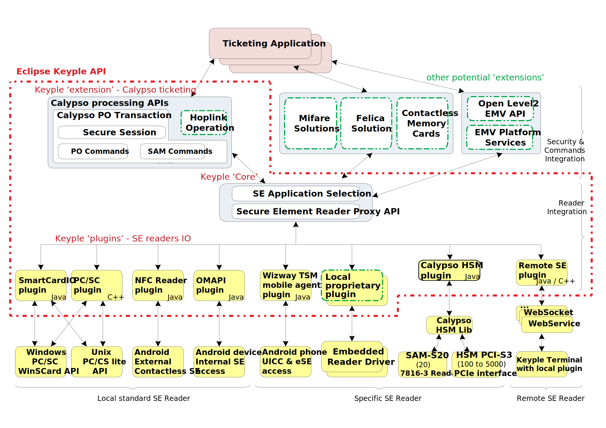
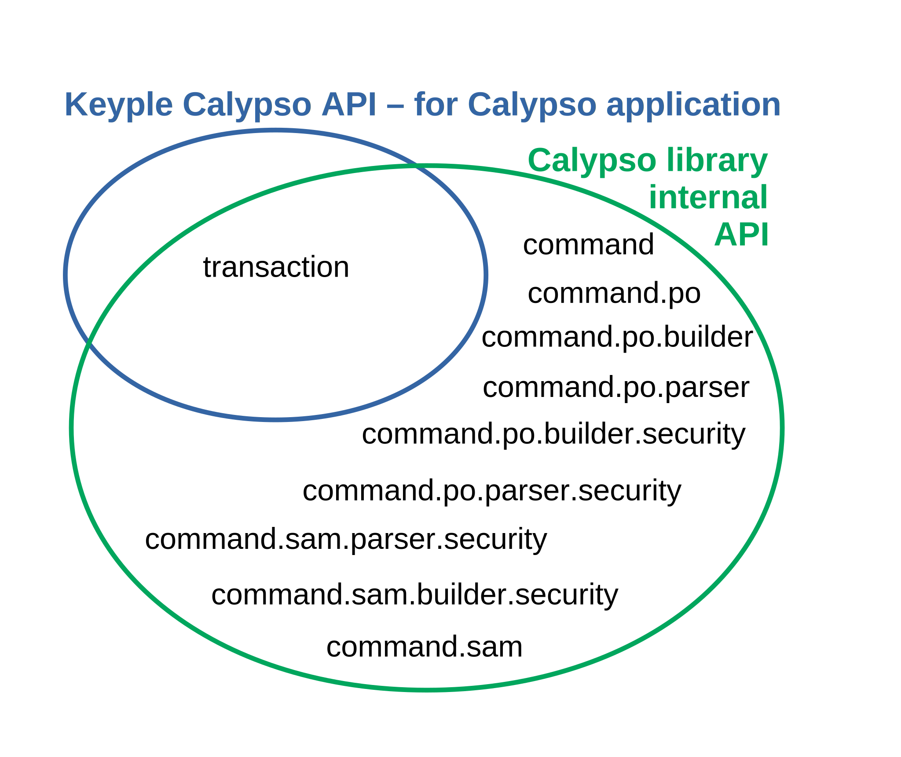

# 'Eclipse Keyple' C++ implementation

This is the repository for the C++ implementation of the '[Eclipse Keyple](https://keyple.org/)' API.

 - [Global Architecture of Keyple](#global-architecture-of-keyple)
   - [Supported platforms](#supported-platforms)
   - [keyple-cpp repositories structure](#keyple-cpp-repositories-structure)
   - [Keyple features and corresponding packages](#keyple-features-and-corresponding-packages)
   - [Keyple packages and corresponding usages](#keyple-packages-and-corresponding-usages)
 - [Getting started](#getting-started)
   - [Cloning this project](#cloning-this-project)
 - [Artifacts](#artifacts)
 - [Building the Keyple components](#)
   - [C++ components](#cpp-components)

---
## Global Architecture of Keyple



The API is currently divided in two major layers:
- The ‘Keyple Core' : a Secure Element Proxy API which allows managing SE readers in a generic way, whaterver the reader driver or environment, and for standalone or distributed solution ([Keyple Core User Guide](./docs/KeypleCore_UserGuide.md)).
- A ‘Calypso Keyple extension' : a high level Calypso Processing API allowing to operate commands with a Calypso Portable Object, and to manage a secure Calypso transaction ([Keyple Calypso User Guide](./docs/KeypleCalypso_UserGuide.md)).

Dedicated reader’s plugins have to be implemented in order to interface the SE Proxy API with the specific reader’s drivers.

### Supported platforms
- Windows / Linux / MacOS
- G++ 6 and higher, MSVC++ 14 (other compilers untested)

### keyple-cpp repositories structure

- Modules that are provided as artifacts
  - keyple-core: source and unit tests for the SE Proxy module (artifact : keyple-cpp-core)
  - keyple-calypso: source and unit tests for the Calypso library (artifact : keyple-cpp-calypso)
  - keyple-plugin: source and unit tests for the different plugins: PC/SC, Stub, etc.
- Developer support, testing
  - example: source for Keyple implementation examples, generic or Calypso specific.

### Keyple features and corresponding packages

Keyple features global for any Secure Element solution:

| Features                                     | Packages  |
| -------------------------------------------- |-------------|
| Selections of Secure Elements (high level API) | keyple::core::**selection** |
| Management of SE readers | keyple::core::**seproxy** |
| Notifications of reader plug/unplug, of SE insertion/remove<ul><li>definition of automatic selection request in case of SE insertion on an Observable Reader.</li></ul> | keyple::core::seproxy::**event** |
| Communication protocols filters (setting for contactless/contacts SE Reader) | keyple::core::seproxy::**protocol** |
| Reader plugins implementation support <ul><li>Utility classes providing generic processing for SE Reader Plugins</li></ul> | keyple::core::seproxy::**plugin** |
| Transmition of grouped APDU commands to a SE Reader (low level API) | keyple::core::seproxy::**message** |
| SE specific library implementation support <ul><li>generic API to build a SE specific commands library</li></ul> | keyple::core::**command** |

Keyple features defined to support the Calypso solution:

| Features                                     | Packages  |
| -------------------------------------------- |-------------|
| Calypso Portable Object commands and secure transaction management <ul><li>high level CalypsoAPI, commands’ settings are limited to functional parameters</li><li>Calypso SAM (Secure Module) operations automatically processed</li></ul> | keyple::calypso::**transaction** |
| Calypso PO responses data parsing | keyple::calypso::command::**po.parser** |
| Calypso SAM responses data parsing | keyple::calypso::command::**sam.parser** |
| Calypso PO & SAM commands' sets<ul><li>low level Calypso API, commands’ settings include technical parameters specific to Calypso PO revisions or Calypso SAM revisions</li></ul> | <ul><li>keyple::calypso::**command**</li><li>keyple::calypso::command::**po**</li><li>keyple::calypso::command::**po::builder**</li><li>keyple::calypso::command::**po::parser::session**</li><li>keyple::calypso::command::**sam::parser::session**</li><li>keyple::calypso::command::**sam::builder**</li><li>keyple::calypso::command::**sam**</li></ul> |

### Keyple packages and corresponding usages
Depending on the targetting usage: implementation of a ticketing **application** (blue circle), a reader **plugin** (red circle), or a **SE library** (green circle), only specific Keyple packages must be imported.

- generic packages for any SE solution


- specific packages for Calypso


---

## Getting started

### Cloning this project
Examples provided in this project relies on symbolic links to handle their common dependencies. (Please refer to this [file](example/README.md) for more information).

Although symlink support should be provided out of the box for Unix users, **Windows users** should be aware that the git option `core.symlinks` needs to be enabled before [cloning](https://help.github.com/en/articles/cloning-a-repository) this repo. Several solutions can be considered:
- When installing git for Windows, an option `Enable symbolic links` can be choosen. If it has not been enabled and you want to set it via the installer, a reinstallation is needed
- If you do not want to reinstall git, this option can be enabled afterward via the command line `git config core.symlinks true`
- Also, the option can be enabled once only for this specific cloning operation with `git clone -c core.symlinks=true REPO_URL`

It is important to note that for this option to be actually working, the Windows user needs to have the **_SeCreateSymbolicLink_ permission**: a user with admin rights is typically granted with this permission.

## Building the Keyple components

This guide helps developer that want to contribute to Keyple components base code. You can fork the project and contribute to it. Every contribution will be reviewed by the developper team and scan by our CI and quality code tools before being merged to the base code.

### C++ components

#### Prerequisites
Here are the prerequisites to build the keyple components (dynamic libraries)
- G++ 6 and higher, MSVC++ 14 (other compilers untested)
- libpcsclite1 package installed (Linux) to build the PC/SC plugin

#### Windows, Linux or Macos
On Linux and macOS, the following commands will build all the artifacts at once
```
mkdir build
cd build
cmake -DCMAKE_TOOLCHAIN_FILE=../toolchain/<toolchain>.cmake ..
make
```

If using Windows or IDEs, CMake support must be installed. Compilation should automatically be handled.

## Trademarks

* Eclipse Keyple and the Eclipse Keyple project are Trademarks of the Eclipse Foundation, Inc.
* Eclipse® is a Trademark of the Eclipse Foundation, Inc.
* Eclipse Foundation is a Trademark of the Eclipse Foundation, Inc.

## Copyright and license

Copyright 2020 the [Eclipse Foundation, Inc.](https://www.eclipse.org) and the [Keyple C++ authors](https://github.com/eclipse/keyple-cpp/graphs/contributors). 
Code released under the [Eclipse Public License Version 2.0 (EPL-2.0)](https://github.com/eclipse/keyple-cpp/blob/src/LICENSE).
